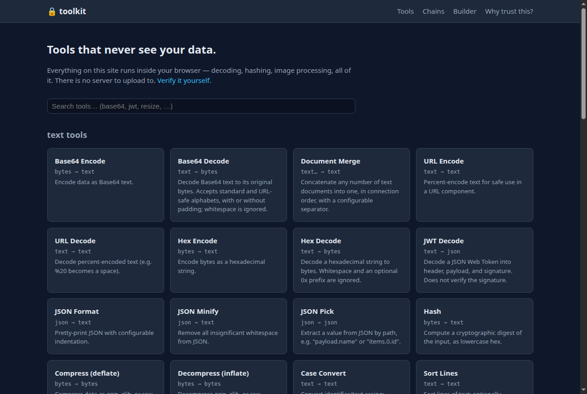
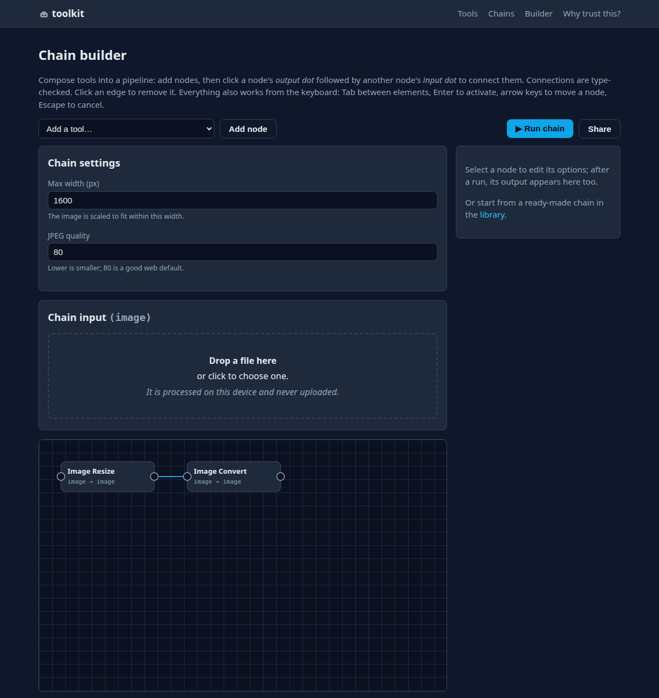

# toolkit

Everyday data tools that run entirely on your device: in the browser as
WebAssembly, or in your terminal as a single static binary. There is no
server, so the JWT you decode or the photo you strip EXIF from never
leaves your machine.

Try it: [koundinyagoparaju.github.io/toolkit](https://koundinyagoparaju.github.io/toolkit/)

Or install the CLI:

```sh
# Linux / macOS
curl -fsSL https://raw.githubusercontent.com/koundinyagoparaju/toolkit/main/scripts/install.sh | sh
# Windows (PowerShell)
irm https://raw.githubusercontent.com/koundinyagoparaju/toolkit/main/scripts/install.ps1 | iex

echo -n "$JWT" | toolkit chain 'jwt-decode | json-format'
toolkit chain -n image-web-ready --set width=800 -i photo.png -o photo.jpg
toolkit run hash -i backup.iso                  # streams, gigabytes in a few MB of RAM
```

The tools: base64/32/58, URL and hex encoding, JWT inspection, JSON to and
from YAML/TOML/CSV, hashing and HMAC, timestamps, regex extraction, diffs,
gzip, QR codes, password and UUID generation, EXIF stripping, image
resize/crop/convert/merge. About 50 of them, and they compose into
pipelines (chains) you can share as URLs. The URL encodes the chain
definition, not your data.

## Checking the privacy claims

You shouldn't have to take any of this on faith, so each claim comes with
a way to check it.

| Claim | How to check |
| --- | --- |
| No server receives your data | The site is static files. Open DevTools, watch the Network tab while using any tool: nothing goes out. |
| Even malicious code would have trouble exfiltrating | The `Content-Security-Policy` (`default-src 'none'; connect-src 'self'`) makes the browser refuse outbound connections. Try `fetch("https://example.com")` in the console. Not an absolute barrier, which is why the rows below matter more. |
| Works with the network unplugged | It's an offline-capable PWA. Airplane mode is a fine test. |
| The code is what you audited | Tools are Rust with a small pure-Rust dependency set, compiled to wasm. The wasm modules import nothing from the host and the loader checks each one against a pinned sha256. Community tools and chains enter through reviewed PRs only; the site never loads code from anywhere else. |
| The binaries match the source | Builds are reproducible (pinned toolchain, locked deps, normalized paths, enforced in CI) and releases carry GitHub provenance attestations. Rebuild one yourself: [docs/architecture.md](docs/architecture.md#reproducing-a-release). |
| The CLI can't phone home | It contains no network code at all. Build it from source if you prefer: `cargo install --path crates/cli`. |

## The web app

Live at [koundinyagoparaju.github.io/toolkit](https://koundinyagoparaju.github.io/toolkit/).
Works offline after the first visit.



The chain builder composes tools into typed pipelines. Here two resize
branches fan into image-merge's named ports:



To run it locally:

```sh
./scripts/build-web-assets.sh   # compile tool packs to wasm, emit the catalog
cd web && npm install && npm run dev
```

## The CLI

The install one-liners at the top download the latest release for your
platform and verify its SHA-256 checksum. Package managers work too; the
tap and bucket live in this repo, so what you install is what you can
read here:

```sh
# Homebrew (macOS/Linux)
brew tap koundinyagoparaju/toolkit https://github.com/koundinyagoparaju/toolkit
brew install koundinyagoparaju/toolkit/toolkit
```

```powershell
# Scoop (Windows)
scoop bucket add toolkit https://github.com/koundinyagoparaju/toolkit
scoop install toolkit
```

Piping a script into your shell means trusting it, and this project's
whole point is that you shouldn't have to. Each install script is about
90 lines. Read it first, or skip it and build from source:

```sh
cargo build --release -p toolkit-cli   # -> target/release/toolkit
```

Usage:

```sh
toolkit list                                      # what's available
toolkit run base64-encode 'hello world'           # input as an argument
echo -n 'hello' | toolkit run base64-encode       # or from stdin
toolkit run image-resize --set width=800 -i in.png -o out.png

# multi-input tools take one file per named port:
toolkit run image-merge -i first=a.png -i second=b.png --set mode=vertical -o out.png
# variable-arity ports (marked "…" in `toolkit list`) take repeated -i:
toolkit run doc-merge -i a.txt -i b.txt -i c.txt --set separator=$'\n---\n'

# chains, as pipe syntax:
echo "$JWT" | toolkit chain 'jwt-decode | json-format indent=4'
# or from the library, with declared typed parameters:
toolkit chains
toolkit chain --name image-web-ready --set width=800 -i photo.png -o photo.jpg
toolkit chain --file my-chain.json -i input.txt
```

Tab completion covers tool names, options with their enum values
(`toolkit run hash --set algorithm=<TAB>` offers the algorithms), chain
names (`toolkit chain -n <TAB>` lists your library), and chain params.
Works in bash, zsh, and fish; PowerShell gets commands and flags. Put the
files at these paths and the installer keeps them fresh on every update:

```sh
toolkit completions zsh  > ~/.zsh/completions/_toolkit   # add the dir to fpath, run compinit
toolkit completions fish > ~/.config/fish/completions/toolkit.fish
toolkit completions bash > ~/.local/share/bash-completion/completions/toolkit
```

```powershell
toolkit completions powershell > "$env:LOCALAPPDATA\toolkit\completions.ps1"
Add-Content $PROFILE '. "$env:LOCALAPPDATA\toolkit\completions.ps1"'
```

Your own chain files go in `~/.config/toolkit/chains/` and run by name.
Chains are pure data, so dropping files there needs no code trust. To
update the CLI, re-run the install one-liner (it checks your version) or
use your package manager. The binary itself never updates itself; it has
no network code to do it with.

## How it's put together

```
crates/core         the contract: typed values (text/bytes/json/image) with a
                    coercion matrix, tool manifests (options auto-generate web
                    forms and CLI flags), the chain (DAG) schema + executor,
                    and the wasm pack ABI
crates/packs/text   encodings, json, hash, gzip, diff, case/sort/escape tools
crates/packs/image  resize, crop, convert, compress, merge, EXIF, QR codes
crates/packs/crypto hmac, base32/58, uuid + password + random-byte generators
crates/packs/data   json/yaml/toml/csv, xml, timestamps, url, regex, markdown
crates/cli          `toolkit` binary, links the packs natively
web/                Svelte app: catalog, tool pages, DAG chain builder;
                    loads the same packs as lazily-fetched wasm modules
chains/             community chain library (pure data, no code)
```

One tool implementation serves both frontends. The CLI links the Rust
directly; the browser fetches the same crate compiled to WebAssembly over
a small hand-written ABI (no codegen, see `crates/core/src/abi.rs`).
Chains are a versioned JSON DAG, and the same file runs in the CLI, the
web builder, and the shareable-URL encoding.

Tools declare typed, named input ports. Most have one; `image-merge` has
`first` and `second`; a `multi` port like doc-merge's `documents` accepts
any number of connections, in order. Chains wire ports into a DAG with
fan-out, and every edge is type-checked, with a few sanctioned runtime
coercions (bytes to text if valid UTF-8, and so on). A chain can also
declare params, which are named typed knobs (`width`, `quality`) mapped
onto node options. That makes a chain a callable unit: the CLI takes
`--set width=800`, the web builder renders a settings form.

Streaming tools (hash, base64, hex, URL, doc-merge, marked `streaming`
in the catalog) process input incrementally. Hashing a multi-gigabyte
file takes about 5 MB of RAM in the CLI, and the browser feeds dropped
files chunk by chunk via `file.stream()` without loading them. Chains
run on one push-based dataflow engine for both buffered and streaming
modes: streaming nodes pass chunks through, tools that need the whole
value (images, JSON) buffer only at their own inputs. Memory is bounded
by the largest single buffered step, not the sum of intermediates.

Generators (uuid, password-gen, random-bytes) take randomness through an
explicit `entropy` input port that the driver fills, from the OS RNG in
the CLI and `crypto.getRandomValues` in the browser. This keeps tools
pure functions and the wasm sandbox at zero host imports, and anyone
auditing a request can see the entropy in it. You can even wire fixed
bytes into the port for reproducible output.

On dependencies: anything that touches user data is Rust with a minimal,
pinned, pure-Rust dependency set (vendorable with `cargo vendor`, gated
by `cargo audit` and `cargo vet` in CI). npm exists only for the web
shell, svelte and vite and nothing else, and the CSP backstops it. Every
tool must work on plain single-threaded CPU; hardware acceleration can
only ever be an additive fast path.

## Hosting

Any static file host works. Serve `web/dist` and send the CSP as an HTTP
header (it's also in a `<meta>` tag, but a header covers more):

```
Content-Security-Policy: default-src 'none'; script-src 'self' 'wasm-unsafe-eval'; style-src 'self' 'unsafe-inline'; img-src 'self' blob: data:; connect-src 'self'; manifest-src 'self'; worker-src 'self'; base-uri 'none'; form-action 'none'; frame-ancestors 'none'
```

## Contributing

Adding a tool is one Rust file plus a registry line. Adding a chain is
one JSON file. Start with [CONTRIBUTING.md](CONTRIBUTING.md); concepts
and walkthroughs are in [docs/](docs/concepts.md).

## License

Apache-2.0
